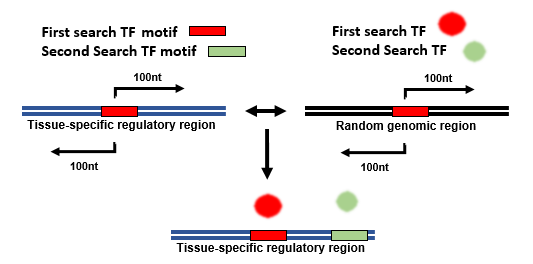

# CocoTF: a pipeline to predict context-specific co-occurring TF motifs

To investigate the combinatorial TF landscape of context-specific regulatory regions we designed cocoTF, a workflow to identify context-specific co-occurring TF motifs. CocoTF consists of two main steps. The first is the identification of context-specific TF whose motifs are enriched within the corresponding context-specific regulatory regions. We refer to these TFs as First Search TFs. The second step is to carry out motif enrichment analysis in regions flanking First Search TF motifs within regulatory regions of interest to identify co-occurring motifs. We refer to these as Second Search TFs.



## CocoTF implementation

The code included in this repository, corresponds to CocoTF's second step: **identifying Second Search TFs**. Thus to run this code you should have:
1. The PWM corresponding to your previously identified First Search TFs.
2. A set of input regulatory regions (e.g tissue-specific enhancers).

If you do not have both of these, refer to the original publication for suggestions on how to identify context-specific TFs and regulatory regions using comparative studies of RNA-seq and corresponding H3K27ac data. If you clicked this link from the paper hoping to find code to identify First Search TFs, email the author who will do her best to help.

### Required software
CocoTF is run as a pipeline on the command line.

- Bedtools: CocoTF uses bedtools intersect and bedtools random.
[Bedtools installation page](https://bedtools.readthedocs.io/en/latest/content/installation.html).
- HOMER: CocoTF uses scanMotifGenomeWide.pl and findMotifsGenome.pl.
[HOMER installation page](http://homer.ucsd.edu/homer/introduction/install.html).
- R/Rstudio: CocoTF's output data is then formatted using an R script.
[Rstudio installation page](https://pages.github.com/).

### CocoTF scripts

CocoTF consists of several scripts. However, running run_pipeline.sh (which contains sample cocoTF runs) runs pipeline.sh and mkdir.sh. 

#### mkdir.sh

This script creates all results folders for your project.
- $project **-p** the name of the project, this should be the same as the -p argument in pipeline.sh.

The necessary folders are created in the main directory and are the following:
```
mkdir pipeline_results_${project}
mkdir pipeline_results_${project}/known_results
mkdir pipeline_results_${project}/bed_files
mkdir pipeline_results_${project}/motif_files
mkdir temp
```
If you are running CocoTf multiple times for the same project an error will occur where these folders will not be able to be created as they already exist. ignore this error.

#### pipeline.sh

- $motif_file **-m**: the PWM file/ motif file 
- $input_file **-f**: the input file containing context-specific regions matching the context at which the TF of interest is specifically expressed (e.g ventricle-specific enhancers and ventricle-restricted TF GATA4).
- $genome **-g**: genome build (e.g mm9, mm10, hg38). If this is unset, the default is hg38.
- $genome_file **-b**: genome file, including file path. Currently hg38 and mm19 files are stored within genomes folder
- $output_folder **-o**: name of the output folder
- $size **-s**: the size argument determines how many nucleotides either side of the first search TF motif are used for motif enrichment analysis. If remains unset, the default is 200 (100nt either side).
- $project **-p**: the name of the project, this should be the same as the -p argument in mkdir.sh.

As well as the above parameters, CocoTF will define the folloing from the above:
```
MOTIF_NAME=$(basename "$motif_file")
INPUT_NAME=$(basename "$input_file")
```

First step is to identify all instances of the First Search TF motif in the genome:
```
scanMotifGenomeWide.pl $motif_file $genome  -bed > temp/TF_coordinates_${MOTIF_NAME}.bed
```

Then CocoTF intersects all TF motif coordinates with inout regions of interest to determine **FOREGROUND** regions:
```
bedtools intersect -a temp/TF_coordinates_${MOTIF_NAME}.bed -b $input_file > temp/TF_coordinates_ChIPseqregions_${MOTIF_NAME}.bed
```

Next, CocoTF determines **BACKGROUND** regions by intersecting all First Search TF motif instances with a random set of 1kb genomic regions. The starting number of genomic regions is twice the number of regions in your input set. If your input regions are of another fixed width (e.g 5kb) change 1000nt for your desired width. 

```
#calculate number of starting background regions
read lines <<< $(wc -l < $input_file)
number=$((lines*2))
#generate df of random 1000nt bins
bedtools random -n $number -l 1000 -g $genome_file > temp/Random_genome_${INPUT_NAME}.bed
#find instances of first search motif in the random bins
bedtools intersect -a temp/TF_coordinates_${MOTIF_NAME}.bed -b temp/Random_genome_${INPUT_NAME}.bed > temp/background_${INPUT_NAME}.bed
```
Once the **FOREGROUND** and **BACKGROUND** are determined, CocoTF performs motif enrichment analysis 100nt either side of the first TF motif in foreground and background. In pipeline.sh, the window size is 100nt either side as default, but it can be changed with the **-s**/$size parameter.
```
findMotifsGenome.pl temp/TF_coordinates_ChIPseqregions_${MOTIF_NAME}.bed $genome ../pipeline_results_$project/${output_folder}_$size -bg temp/background_${INPUT_NAME}.bed -len 5,6,7,8,9,10,11,12 -size $size
```
**The list of enriched motifs (as part of the HOMER output) is copied into a separate folder, previously created in the mkdir.sh. This file is the one which will be processed using the making_network_dataframe.R**
```
cp pipeline_results_$project/${output_folder}_$size/knownResults.txt pipeline_results_$project/known_results/knownResults_${output_folder}_$size.txt
```
CocoTF also concatenates all known motifs from HOMER output into a single file, named after the First Search motif and the tissue sample. Although CocoTF does not use these files for further analysis, it might be useful to have the enriched PWMs as a text file.
```
cd pipeline_results_$project/${output_folder}_$size/knownResults/ 
#for f in *.motif; do TF="$(<"$f" grep -oP '(?<=\t).*?(?=/)')" && sed -i "1s/.*/>"$TF"/" "$f" ; done
cat *.motif >> pipeline_results_$project/motif_files/${MOTIF_NAME}_all_known_motifs.txt
```


#### making_network_dataframe.R
```
### create a file.list with all knownResults__${output_folder}_$size.txt by running the following commands in the pipeline_results_$project/known_results folder
file.list <- list.files(pattern = "\\.txt$")
#create output folders
dir.create("p5e5") 
dir.create("p5e5/Network")
#pipeline_significant_known_motifs <- function(filename, filepath, outputpath, pvalue, enrichment)
#apply the pipeline_significant_known_motifs function to all files in file.list. Switch $project for project name. 
#In the example below, the ouput folder is p5e5, the p-value cut off is p<= 1e-5 and the enrichemnt cut-off is > 5% enrichment in the foreground, hence the 5, 5 parameters. A p-value parameter of 10 represents p<= 1e-10.

significant <- sapply(file.list, pipeline_significant_known_motifs,"pipeline_results_$project/known_results", "p5e5", 5, 5)
```
### CocoTF sample input data

#### run_pipeline.sh
Sample code within run_pipeline is:

```
bash scripts/mkdir.sh -p test_data

bash scripts/pipeline.sh -m motifs/NeuroG1_palate.motif -f input_data/H3K27ac_palate_specific.bed  -o NeuroG1_palate_100 -b genomes/hg38.genome -p test_data

```
### Link to academic paper
### Bibliography
Heinz, S. et al. (2010) ‘Simple combinations of lineage-determining transcription factors prime cis-regulatory elements required for macrophage and B cell identities’, Molecular Cell, 38(4), pp. 576–589. doi:10.1016/j.molcel.2010.05.004. 

Quinlan, A.R. and Hall, I.M. (2010) ‘BEDTools: A flexible suite of utilities for comparing genomic features’, Bioinformatics, 26(6), pp. 841–842. doi:10.1093/bioinformatics/btq033. 


